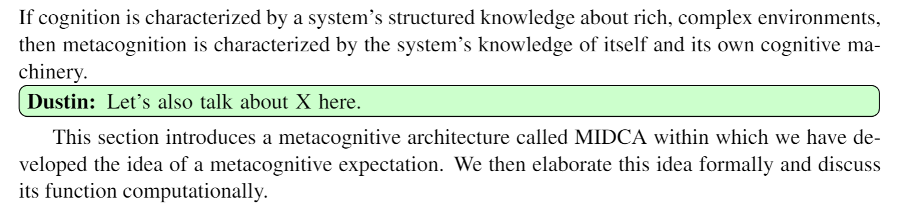

## Colored Comments in LaTeX

I've found this to be super useful when collaborating on a shared LaTeX document. At the top of the document include the following and define your own personal note (and color!). Here's an example where I (Dustin) and my friend Adam have each made a note:

```tex
\usepackage{todonotes} % for comments
\newcommand{\dustin}[1]{\todo[inline,color=green!20!white]{\textbf{Dustin:} #1}}
\newcommand{\adam}[1]{\todo[inline,color=blue!20!white]{\textbf{Adam:} #1}}
```

Then when you are ready to use your note, just do this in the text:

```tex
If cognition is characterized by a system's structured knowledge about rich, complex
environments, then metacognition is characterized by the system's knowledge of itself
and its own cognitive machinery.
\dustin{Let's also talk about X here.} 
This section introduces a metacognitive architecture called MIDCA within which we have
developed the idea of a metacognitive expectation. We then elaborate this idea formally
and discuss its function computationally. 
```

And it looks like:



_November 4, 2018_